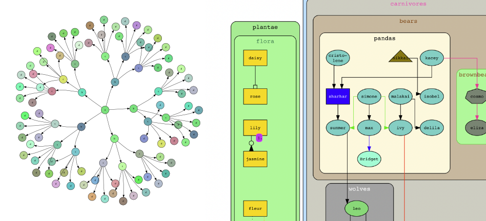
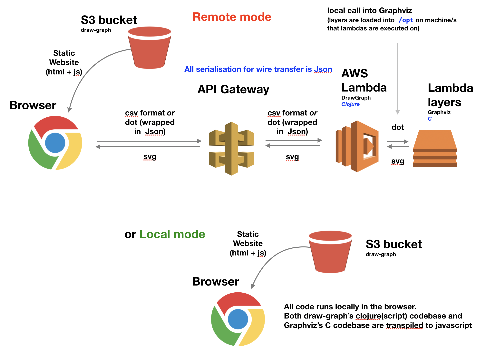

The code behind [draw-graph.com](https://draw-graph.com)
 

# draw-graph

draw-graph is an example Clojure application on AWS Lambda with a Clojurescript single page web application front end that is deployed in an AWS S3 bucket.
draw-graph uses [Graphviz](https://www.graphviz.org/) in the AWS Lambda function to produce an svg representation of a simple csv format description of the graph.
Please see the demonstration deployment of the application at [draw-graph.com](https://draw-graph.com), which has examples and a help page that explains how the input should be structured.

## Motivation

I wrote draw-graph to help automate the production of 'how things connect' style diagrams in the enterprise. From personal experience it can often take many hours to produce complex diagrams by hand in tools like Visio. Graphviz is a great library for producing diagrams from data descriptions, but it's input format (the 'dot' language) is off-puttingly hard for the non technical to produce automatically and off-puttingly laborious to produce by hand.

However, there's is a lot of information either locked up in spreadsheets or can be got into spreadsheets as well as a lot of proficient users of tools like Excel in the enterpriseand in general. Creating a simple csv format over the 'dot' language seemed like a good compromise.

## Structure

The draw-graph source comes in three parts which are in the folders above. Each of the folders has an additional README with more information about how to get things up and running.
draw-graph is perhaps not intended to be deployed yourself as it stands, but I hope could serve as a useful example for any such similar projects.
The three parts:

- draw-graph.core: The front-end website. A simple Clojurescript front end based on Reagent.

- lambda-draw-graph: The code for the Lambda function that has been deployed to Amazon AWS in the EU-West-2 location (London). The Clojure Lambda function calls into a static build of Graphviz which has been mounted as a 'lambda layer'. 

- lib-draw-graph: a library that provides the functionality to convert the input csv format into the dot language and to provide some additional processing on top. This library is in the form of .cljc files to allow me the flexibility to move (some of) the processing between the lambda function on AWS and the Clojurescript front end. 

## Architecture

## Acknowledgements

Thanks to Zachery Tellman for his [Rhizome library](https://github.com/ztellman/rhizome) that I have got a lot of use out of over the last couple of years. In the lib-draw-graph folder, in dot.cljc, I have ported a part of his code to run in both Clojure and Clojurescript (the bit that produces the 'dot' format that is the input into Graphviz).

Thanks also to [iamxuxiao](https://github.com/iamxuxiao/mwgraphviz) for providing instructions on how to do a static build of Graphviz and showing how a C binary could be mounted in an AWS Lambda function. (see 'lambda-draw-graph' folder).

Thanks to [mdaines](https://github.com/mdaines/viz.js) for his incredible work in getting to transpile graphviz to ASM javascript. That must have hurt!

## License

draw-graph is provided under the [MIT License](https://opensource.org/licenses/MIT)
