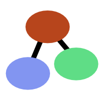
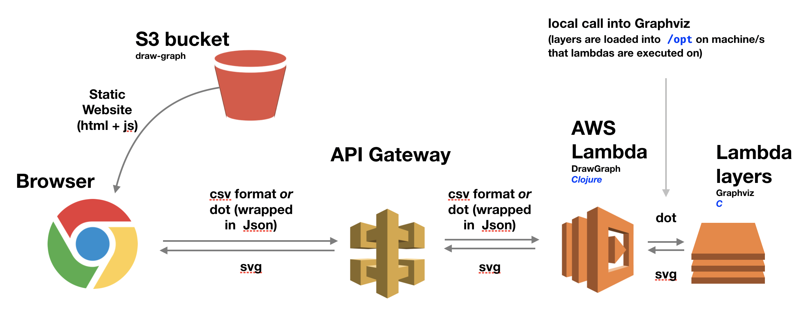

example at [draw-graph.com](https://draw-graph.com)
 

# draw-graph

draw-graph is an example Clojure application on AWS Lambda with a Clojurescript single page web application front end that is deployed in an AWS S3 bucket.
draw-graph uses [Graphviz](https://www.graphviz.org/) in the AWS Lambda function to produce an svg representation of a simple csv format description of the graph.
Please see the demonstration deployment of the application at [draw-graph.com](https://draw-graph.com), which has examples and a help page that explains how the input should be structured.

## Motivation

I wrote draw-graph to solve the problem of production of graph/ network style diagrams in companies. The input format to a tool like Graphviz (i.e. the 'dot' language) is off-puttingly hard for non technical users to produce automatically and off-puttingly laborious to produce by hand, but there is a lot of information either locked up in spreadsheets or can be got into spreadsheets as well as a lot of proficient users of tools like Excel. Creating a simple csv format over the 'dot' language seemed like a good compromise.

The second motivation for draw-graph was to begin to explore the Amazon AWS platform (which I found to be fantastic) and to get Clojure working on AWS.

## Structure

The draw-graph source comes in three parts which are in the folders above. Each of the folders has an additional README with more information about how to get things up and running.
draw-graph is perhaps not intended to be deployed yourself as it stands, but I hope could serve as a useful example for any such similar projects.
The three parts:

- web-draw-graph: The front-end website. A simple Clojurescript front end based on Reagent.
- lambda-draw-graph: The code for the Lambda function that has been deployed to Amazon AWS in the EU-West-2 location (London). The Clojure Lambda function calls into a static build of Graphviz which has been mounted as a 'lambda layer'. 
- lib-draw-graph: a library that provides the functionality to convert the input csv format into the dot language and to provide some additional processing on top. This library is in the form of .cljc files to allow me the flexibility to move (some of) the processing between the lambda function on AWS and the Clojurescript front end. In the end, I settled on moving as much processing as possible to the front end and pretty much just left the final dot->svg conversion handled by Graphviz on the back end.

## Architecture

## Acknowledgements

Thanks to Zachery Tellman for his [Rhizome library](https://github.com/ztellman/rhizome) that I have got a lot of use out of over the last couple of years. In the lib-draw-graph folder, in dot.cljc, I have ported a part of his code to run in both Clojure and Clojurescript (the bit that produces 'dot').

Thanks also to [iamxuxiao](https://github.com/iamxuxiao/mwgraphviz) for providing instructions on how to do a static build of Graphviz and showing how a C binary could be mounted in an AWS Lambda function. In the end, I switch from this approach to putting the binary in a lambda layer.

## License

draw-graph is provided under the [MIT License](https://opensource.org/licenses/MIT)
