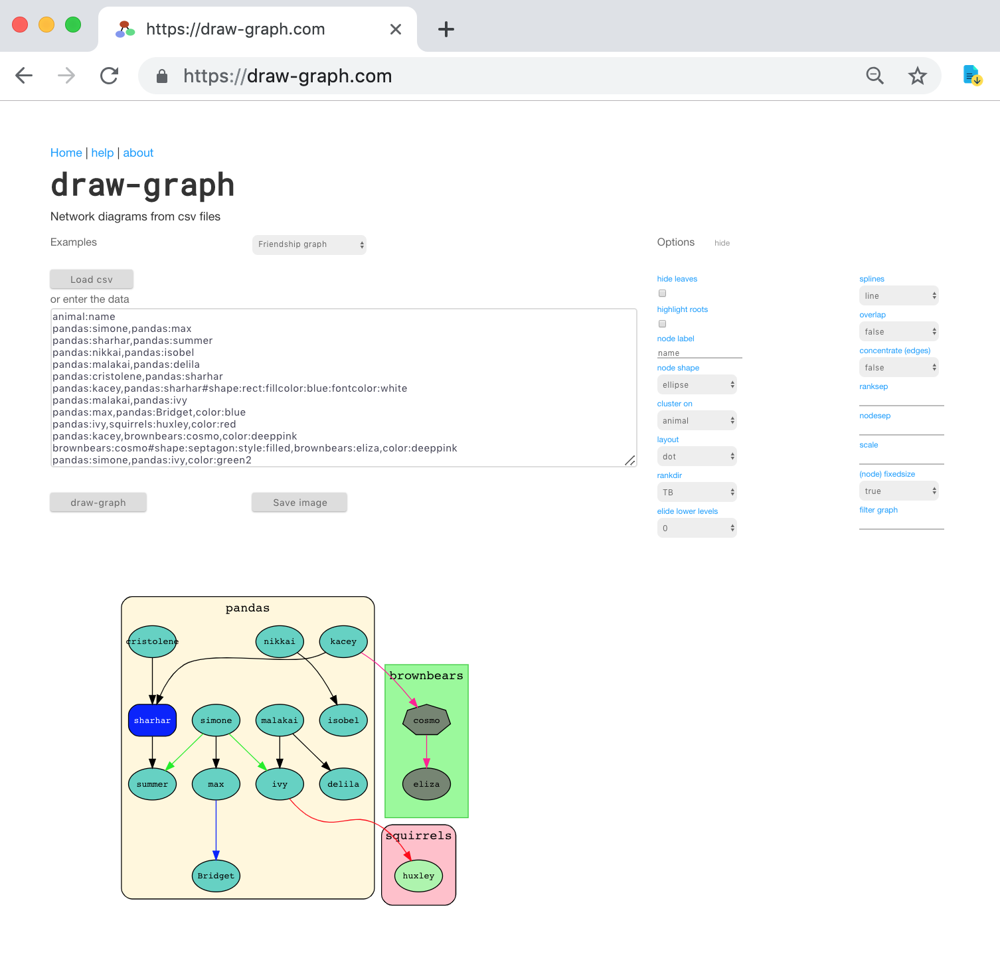

example deployment: [draw-graph.com](https://draw-graph.com)

This project is based on the [Reagent front end template](https://github.com/reagent-project/reagent-frontend-template)

The front end allows for csv files to be uploaded or their contents pasted in, display options to be set and a REST call to be made with the data and options converted to json to the API Gateway instance that I have mounted over my AWS Lambda function. The returned svg is displayed in the browser and can be saved as a separate file.

I work in emacs and quite a nice little streamlining of my workflow for text heavy pages like the help page was to write them as a markdown file (e.g. help.md) and then write an emacs function to minify the contents of that file and paste as a string at the point.
From my `init.el`:

    (defun slurp (filename)
      "Return the contents of FILENAME."
      (with-temp-buffer
        (insert-file-contents filename)
        (buffer-string)))
    
    (defun insert-minified-file ()
      "insert minifed file content."
      (interactive)
      (let* ((filePath (read-file-name "Enter file name: "))
             (text (json-encode-string (slurp filePath))))
        (insert text)))
        
In the future, this could be a Clojure macro that generates text heavy .cljs files from markdown files at compile time.